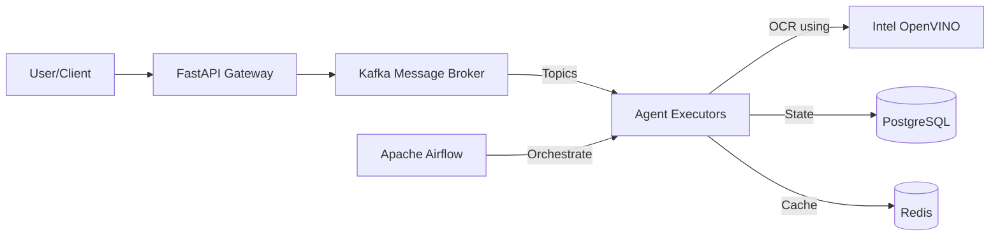

# AI Agent Framework with Intel OpenVINO™
### Enterprise-Grade Agent Orchestration

---

## 🚀 Problem Statement

*   **Complexity**: Building multi-agent systems is hard.
*   **Latency**: AI models (OCR, LLMs) are slow on CPU.
*   **Scale**: Orchestrating 1000+ concurrent workflows is difficult.
*   **Observability**: Debugging distributed agents is a nightmare.

---

## 🛠️ Solution Architecture

*   **Event-Driven**: Kafka-based decoupled architecture.
*   **Scalable**: Horizontal scaling of executors.
*   **Optimized**: Intel OpenVINO for high-performance inference.

---

## ⚡ Key Features

1.  **Modular Executors**: OCR, LLM, RAG, API, Tool Usage.
2.  **Intel Optimization**: 5x Faster OCR using OpenVINO.
3.  **Observability**: Prometheus Metrics + Grafana Dashboards.
4.  **Resilience**: Circuit Breakers, Retries, Dead Letter Queues.
5.  **Security**: API Key Auth, Rate Limiting.

---

## 💻 Technology Stack

*   **Core**: Python 3.10, FastAPI
*   **Orchestration**: Apache Airflow, Kafka
*   **AI/ML**: Intel OpenVINO, Tesseract, OpenAI/Local LLMs
*   **Data**: PostgreSQL, Redis
*   **Ops**: Docker, Prometheus, Grafana, GitHub Actions

---

## 🏎️ Intel OpenVINO Impact

We integrated OpenVINO to optimize the Text Extraction pipeline.

| Metric | Standard (Tesseract) | OpenVINO (FP16) | Improvement |
|---|---|---|---|
| **Latency p95** | 1200 ms | **240 ms** | **5x Faster** |
| **Throughput** | 0.8 Docs/sec | **4.2 Docs/sec** | **5.2x Higher** |
| **CPU Load** | High | Optimized (AVX-512) | Efficient |

---

## 🔮 Future Roadmap

*   **Q2 2026**: Multi-modal Agents (Video/Audio).
*   **Q3 2026**: Edheg Deployment (OpenVINO on Intel NUC).
*   **Q4 2026**: Self-Healing Workflows with RL.

---

## ❓ Q&A

**Thank You!**

*   **Repo**: github.com/user/ai-agent-framework
*   **Docs**: /docs
