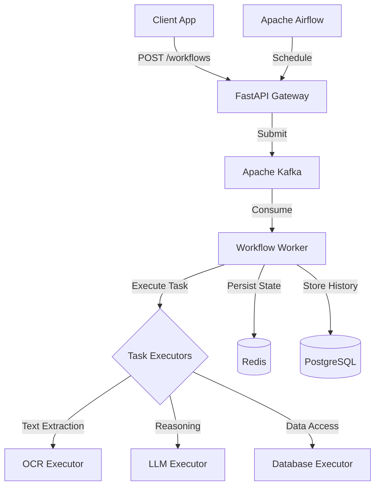

# 🤖 AI Agent Framework (SDK)


A production-ready framework for orchestrating intelligent AI agents. This SDK enables the creation and execution of complex, multi-step workflows involving LLM reasoning, document processing, and stateful interactions.

## 🚀 Features

- **Workflow Orchestration**: Define complex task flows using JSON/YAML and execute them reliability.
- **Intelligent Agents**: Build agents with specialized capabilities (OCR, RAG, Form Filling).
- **Scalable Architecture**: Event-driven design using Apache Kafka and Apache Airflow.
- **State Management**: Robust state persistence with Redis and PostgreSQL.
- **Observability**: Built-in structured logging and Prometheus metrics.
- **Developer Experience**: Comprehensive API, typed SDK, and easy deployment.

## 🏗️ Architecture

The framework follows a modular, event-driven architecture:



## 📋 Prerequisites

- **Docker** and **Docker Compose** (v2+)
- **Python 3.10+** (for local development)
- **Git**

## 🏁 Quick Start

The easiest way to get started is using the included startup script, which handles validaton and orchestration of all services.

1.  **Clone the repository**:
    ```bash
    git clone <repository-url>
    cd ai-agent-framework
    ```

2.  **Run the startup script**:
    ```bash
    ./scripts/startup.sh
    ```
    This script will:
    *   Create `.env` from template (if missing).
    *   Initialize Docker containers (Postgres, Redis, Kafka, Zookeeper, API, Airflow).
    *   Wait for health checks.
    *   Initialize the database and Kafka topics.

3.  **Access the Services**:
    *   **API**: [http://localhost:8000](http://localhost:8000)
    *   **Airflow UI**: [http://localhost:8080](http://localhost:8080) (user: `admin`, pass: `admin`)
    *   **MinIO**: [http://localhost:9001](http://localhost:9001)
    *   **Prometheus**: [http://localhost:9090](http://localhost:9090)
    *   **Grafana**: [http://localhost:3000](http://localhost:3000)

## 🛠️ Manual Setup

If you prefer to run commands manually:

1.  **Environment Setup**:
    ```bash
    cp .env.example .env
    # Edit .env and set AIRFLOW_UID if on Linux: AIRFLOW_UID=$(id -u)
    ```

2.  **Start Infrastructure**:
    ```bash
    docker compose up -d postgres redis zookeeper kafka
    ```

3.  **Start Application**:
    ```bash
    docker compose up -d api airflow-webserver airflow-scheduler airflow-worker
    ```

4.  **Initialize**:
    ```bash
    # Init Database
    docker compose exec api python -m src.database.init_db
    
    # Create Topics
    docker compose exec kafka kafka-topics --create --topic workflows --bootstrap-server localhost:9092
    ```

## 📖 API Documentation

The REST API is built with FastAPI. Interactive documentation is available at:

*   **Swagger UI**: [http://localhost:8000/docs](http://localhost:8000/docs)
*   **ReDoc**: [http://localhost:8000/redoc](http://localhost:8000/redoc)

### Common Endpoints

**Submit a Workflow**
```bash
curl -X POST "http://localhost:8000/api/v1/workflows" \
  -H "Content-Type: application/json" \
  -d '{
    "workflow_id": "knowledge_qa_v1",
    "input": {
        "query": "What are the requirements?"
    }
  }'
```

**Check Status**
```bash
curl "http://localhost:8000/api/v1/workflows/{execution_id}"
```

**List Agents**
```bash
curl "http://localhost:8000/api/v1/agents"
```

## 🧪 Testing

Run the test suite to verify the framework:

```bash
# Install test dependencies
pip install -r requirements.txt

# Run unit tests
pytest tests/unit

# Run full suite (requires running infrastructure)
pytest tests/
```

### Standalone Verification
Specific components can be verified using scripts in `scripts/`:
*   `python scripts/verify_task_flow_parser.py`: Verify workflow parsing logic.
*   `python scripts/verify_state_manager.py`: Verify Redis state persistence.

## 📂 Project Structure

```
ai-agent-framework/
├── src/
│   ├── api/            # FastAPI routes and schemas
│   ├── core/           # Core logic (Orchestrator, TaskFlow, StateManager)
│   ├── database/       # DB models and connection
│   ├── executors/      # Task execution modules (LLM, OCR, etc.)
│   └── kafka/          # Message queue handlers
├── workflows/          # JSON workflow definitions
├── scripts/            # Helper scripts (startup, verification)
├── tests/              # Unit and integration tests
├── docker-compose.yml  # Infrastructure definition
└── README.md           # This file
```

## ❓ Troubleshooting

**Issue**: `ModuleNotFoundError: No module named 'src'`
*   **Fix**: Ensure you run python commands from the project root, e.g., `python -m src.main`.

**Issue**: Kafka connection failed.
*   **Fix**: Ensure Zookeeper is running first. Use `startup.sh` which handles start order.

**Issue**: Airflow permission errors on Linux.
*   **Fix**: Ensure `AIRFLOW_UID` is set in `.env` matching your user ID (`id -u`).

## 🤝 Contributing

1.  Fork the repository.
2.  Create a feature branch (`git checkout -b feature/amazing-feature`).
3.  Commit your changes (`git commit -m 'Add amazing feature'`).
4.  Push to the branch (`git push origin feature/amazing-feature`).
5.  Open a Pull Request.

## 📄 License

This project is licensed under the MIT License - see the `LICENSE` file for details.
