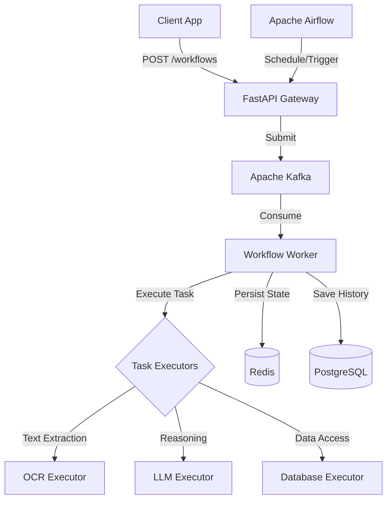

# 🤖 AI Agent Framework (SDK)


**A production-ready framework for orchestrating intelligent AI agents.**

This SDK enables the creation and execution of complex, multi-step workflows involving LLM reasoning, document processing, and stateful interactions. It is designed to be scalable, reliable, and observable.

---

## 🚀 Key Features

*   **Workflow Orchestration**: Define complex task flows using JSON/YAML and execute them reliably with Apache Airflow or a lightweight local orchestrator.
*   **Intelligent Executors**: Built-in modules for LLM reasoning (OpenAI/Ollama), OCR (Tesseract), Data Validation, and API interactions.
*   **Scalable Architecture**: Event-driven design utilizing Apache Kafka for asynchronous processing and Celery for distributed task execution.
*   **Robust State Management**: Persist execution state, intermediate outputs, and history using Redis and PostgreSQL.
*   **Observability**: Integrated structured logging and Prometheus metrics for real-time monitoring.
*   **Developer Experience**: Typed SDK (Pydantic), comprehensive REST API, and easy containerized deployment.

## 🏗️ Architecture

The framework follows a modular, event-driven architecture designed for high throughput and reliability.



[Read more in the detailed Architecture Guide →](docs/ARCHITECTURE.md)

## 🏁 Quick Start (5 Minutes)

Get the framework running locally using the automated startup script.

### Prerequisites

*   **Docker** & **Docker Compose** (v2+)
*   **Git**
*   **Python 3.10+** (for local CLI usage)

### Installation

1.  **Clone the repository**:
    ```bash
    git clone https://github.com/your-org/ai-agent-framework.git
    cd ai-agent-framework
    ```

2.  **Run the startup script**:
    ```bash
    ./scripts/startup.sh
    ```
    *This script initializes configuration, builds Docker images, starts services (Postgres, Redis, Kafka, API, Airflow), and runs health checks.*

3.  **Access the Dashboard**:
    *   **API Docs**: [http://localhost:8000/docs](http://localhost:8000/docs)
    *   **Airflow UI**: [http://localhost:8080](http://localhost:8080) (User/Pass: `admin`/`admin`)

### Run an Example Workflow

Submit a simple "Knowledge Q&A" workflow via the API:

```bash
curl -X POST "http://localhost:8000/api/v1/workflows" \
  -H "Content-Type: application/json" \
  -d '{
    "workflow_id": "knowledge_qa_v1",
    "input": {
        "query": "What are the capabilities of this framework?"
    }
  }'
```

Returns:
```json
{"execution_id": "550e8400-e29b-41d4-a716-446655440000", "status": "QUEUED"}
```

## 📚 Documentation

*   **[Architecture Overview](docs/ARCHITECTURE.md)**: Deep dive into components, data flow, and design choices.
*   **[API Reference](docs/API_REFERENCE.md)**: Complete guide to REST endpoints, schemas, and usage.
*   **[Creating Agents](docs/CREATING_AGENTS.md)**: Tutorial on building custom agents, defining workflows, and writing executors.
*   **[Deployment Guide](docs/DEPLOYMENT.md)**: Instructions for Docker Compose, Kubernetes, and Cloud deployment.
*   **[Troubleshooting](docs/TROUBLESHOOTING.md)**: Solutions for common issues and debugging tips.
*   **[Development Guide](docs/DEVELOPMENT.md)**: How to set up a dev environment, run tests, and contribute.

## 🛠️ Technology Stack

*   **Language**: Python 3.10+
*   **API**: FastAPI
*   **Orchestration**: Apache Airflow, Custom Python Engine
*   **Messaging**: Apache Kafka, Celery
*   **Storage**: PostgreSQL (SQLAlchemy), Redis
*   **AI/ML**: OpenAI API, Ollama, Tesseract OCR, LangChain (internal)
*   **Infrastructure**: Docker, Docker Compose

## 🤝 Contributing

We welcome contributions! Please see the [Development Guide](docs/DEVELOPMENT.md) for details on how to set up your environment and submit pull requests.

## 📄 License

This project is licensed under the MIT License - see the [LICENSE](LICENSE) file for details.
