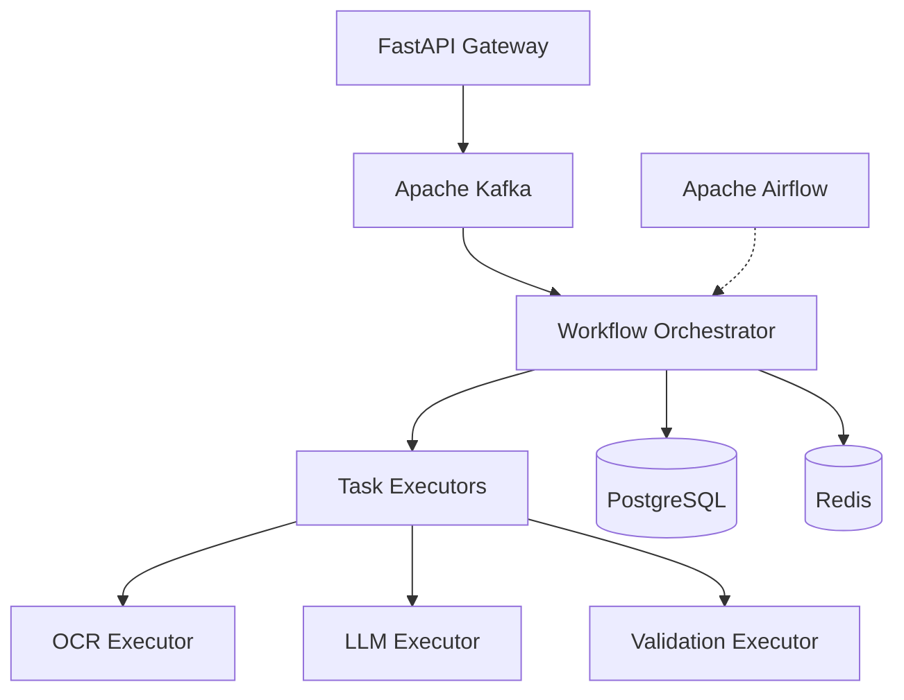

# AI Agent Framework - Mentor Demonstration Guide

> **Purpose**: This guide provides a comprehensive walkthrough for demonstrating the AI Agent Framework project to your mentor, including test execution, verification, and live demonstrations.

---

## 📋 Table of Contents

1. [Project Overview](#project-overview)
2. [Pre-Demo Checklist](#pre-demo-checklist)
3. [Environment Setup](#environment-setup)
4. [Running Tests](#running-tests)
5. [Live Demonstrations](#live-demonstrations)
6. [Performance Benchmarks](#performance-benchmarks)
7. [Troubleshooting](#troubleshooting)

---

## 🎯 Project Overview

### What is this Framework?

The **AI Agent Framework** is a production-ready SDK for orchestrating intelligent AI workflows with:
- **Multi-agent orchestration** using Apache Airflow
- **LLM reasoning** via OpenAI/Ollama integration
- **Event-driven architecture** using Apache Kafka
- **Distributed task execution** with state management
- **Intel OpenVINO optimization** for high-performance inference

### Key Components



### Reference Agents

1. **Form Filling Agent**: Automates government form filling using OCR
2. **Knowledge Q&A Agent**: Answers questions with grounded citations

---

## ✅ Pre-Demo Checklist

Before demonstrating to your mentor, ensure:

- [ ] All dependencies are installed
- [ ] Docker services are running
- [ ] Database is initialized
- [ ] All tests are passing
- [ ] Sample data is prepared
- [ ] Health checks are green

---

## 🔧 Environment Setup

### Step 1: Verify Prerequisites

```powershell
# Check Python version (should be 3.10+)
python --version

# Check Docker
docker --version
docker compose version

# Check Git
git --version
```

### Step 2: Install Dependencies

```powershell
# Navigate to project directory
cd C:\Users\Parthi\Documents\AI-AGENT-FRAMEWORK(ANTIGRAVITY)\AI-agent-framework

# Install Python dependencies
pip install -r requirements.txt

# Install additional test dependencies
pip install pytest pytest-asyncio pytest-cov httpx
```

### Step 3: Environment Configuration

```powershell
# Copy environment file
copy .env.example .env

# Edit .env file to set:
# - DATABASE_URL
# - REDIS_HOST
# - KAFKA_BOOTSTRAP_SERVERS
# - OPENAI_API_KEY (if using OpenAI)
```

### Step 4: Start Docker Services

```powershell
# Start all services in background
docker compose up -d

# Wait for services to be ready (30-60 seconds)
timeout /t 60

# Verify services are running
docker compose ps
```

**Expected Output**:
- postgres: Up
- redis: Up
- kafka: Up
- zookeeper: Up
- api: Up (port 8000)
- airflow-webserver: Up (port 8080)
- airflow-scheduler: Up

---

## 🧪 Running Tests

### Quick Health Check

First, run the comprehensive health check script:

```powershell
python scripts/health_check.py --verbose
```

**Expected Output**:
```
Starting System Health Check...
--------------------------------------------------
[PASS] Database: Connected. Found tables: workflow_definitions, workflow_executions, task_executions, agent_definitions
[PASS] Redis: Connection successful
[PASS] Kafka: Connected. Topics: 15 found.
[PASS] Airflow: Webserver accessible. Scheduler: healthy
[PASS] API: Health endpoint running
[PASS] Executors: Verified: OCRExecutor, LLMExecutor, ValidationExecutor
[PASS] FileSystem: All paths verified
--------------------------------------------------
SYSTEM HEALTHY
```

> [!IMPORTANT]
> If any health checks fail, refer to the [Troubleshooting](#troubleshooting) section before proceeding.

### Unit Tests

Run all unit tests with coverage:

```powershell
# Run unit tests
pytest tests/unit -v --cov=src --cov-report=term-missing

# Or run specific test files
pytest tests/unit/test_ocr_executor.py -v
pytest tests/unit/test_llm_executor.py -v
pytest tests/unit/test_database_models.py -v
```

**Expected Results**:
- ✓ `test_ocr_executor.py`: 5+ tests passing
- ✓ `test_llm_executor.py`: 5+ tests passing
- ✓ `test_database_models.py`: 10+ tests passing
- ✓ Coverage: >70%

### Integration Tests

Test component interactions:

```powershell
# Run integration tests
pytest tests/integration -v -m integration

# Key integration tests
pytest tests/integration/test_workflow_flow.py -v
pytest tests/integration/test_api_database.py -v
pytest tests/integration/test_executor_integration.py -v
```

**Expected Results**:
- ✓ API workflow submission works
- ✓ Database persistence verified
- ✓ Executor chain execution successful

### End-to-End Tests

Test complete workflows:

```powershell
# Run E2E tests
pytest tests/e2e -v -m e2e

pytest tests/e2e/test_complete_workflow.py -v
pytest tests/e2e/test_error_recovery.py -v
```

### Verification Scripts

Run standalone verification scripts (useful for demos):

```powershell
# Verify database models
python tests/verify_models.py

# Verify OCR executor
python tests/verify_ocr_executor.py

# Verify LLM executor
python tests/verify_llm_executor.py

# Verify validation executor
python tests/verify_validation_executor.py

# Verify agents
python tests/verify_agents.py
```

**What to expect**: Each script should print detailed test results with SUCCESS messages.

### Generate Test Report

Create a comprehensive test report:

```powershell
# Run all tests with HTML report
pytest -v --cov=src --cov-report=html --html=test_report.html --self-contained-html

# Open the report
start htmlcov/index.html
start test_report.html
```

---

## 🎬 Live Demonstrations

### Demo 1: Interactive Framework Demo

Use the interactive CLI to showcase framework capabilities:

```powershell
python scripts/interactive_demo.py
```

**What it demonstrates**:
- Agent creation and registration
- Workflow submission
- State persistence
- Real-time execution monitoring

**Demo Script**:
1. Select option `1` - Register a new agent
2. Choose "OCR Document Processor"
3. Submit a test workflow
4. Show execution tracking
5. View results

### Demo 2: REST API Workflow Submission

Show how external systems interact with the framework:

```powershell
# Test API health
curl http://localhost:8000/health

# List available agents
curl http://localhost:8000/api/v1/agents

# Submit a workflow
curl -X POST http://localhost:8000/api/v1/workflows \
  -H "Content-Type: application/json" \
  -d '{
    "workflow_id": "knowledge_qa_v1",
    "input": {
      "query": "What is the AI Agent Framework?"
    }
  }'

# Get execution ID from response, then check status
curl http://localhost:8000/api/v1/workflows/{execution_id}/status

# Get detailed results
curl http://localhost:8000/api/v1/workflows/{execution_id}/results
```

**Expected Flow**:
1. Workflow is accepted (202 status)
2. Execution ID is returned
3. Status progresses: QUEUED → RUNNING → COMPLETED
4. Results contain processed output

### Demo 3: Airflow DAG Visualization

Show workflow orchestration in Airflow UI:

1. **Open Airflow UI**: Navigate to `http://localhost:8080`
2. **Login**: Username: `admin`, Password: `admin`
3. **Navigate to DAGs**: Show the registered agent workflows
4. **Trigger a DAG**: 
   - Click on `form_filling_agent_workflow`
   - Click "Trigger DAG" button
   - Add configuration JSON
5. **View Execution**:
   - Show task dependencies in Graph view
   - Monitor task execution in real-time
   - Show logs for each task

**Key Points to Highlight**:
- Visual task dependency graph
- Retry logic and error handling
- State persistence between tasks
- Execution history

### Demo 4: Agent Workflow Execution

Demonstrate a complete agent workflow from start to finish:

```powershell
# Run Form Filling Agent demo
python tests/verify_agents.py
```

**What happens**:
1. Uploads a sample document (Aadhaar/PAN card)
2. OCR extracts text
3. LLM identifies and extracts fields (Name, DOB, ID)
4. Validation checks data integrity
5. Generates filled form output

**Show**:
- Input document
- Extracted text
- Parsed fields
- Validation results
- Final output

### Demo 5: Knowledge Q&A Agent

```powershell
# Test Q&A workflow
curl -X POST http://localhost:8000/api/v1/workflows \
  -H "Content-Type: application/json" \
  -d '{
    "workflow_id": "knowledge_qa_v1",
    "input": {
      "query": "What are the main components of this framework?",
      "context_docs": ["docs/ARCHITECTURE.md"]
    }
  }'
```

**Expected Output**:
```json
{
  "answer": "The AI Agent Framework consists of...",
  "confidence": 0.92,
  "sources": [
    {"document": "ARCHITECTURE.md", "relevance": 0.95}
  ],
  "grounded": true
}
```

---

## ⚡ Performance Benchmarks

### Benchmark 1: OpenVINO Optimization

Demonstrate Intel OpenVINO performance improvements:

```powershell
# Run OCR benchmark (standard vs optimized)
python scripts/benchmark_openvino.py
```

**Expected Results**:
| Metric | Standard Tesseract | OpenVINO FP16 | Improvement |
|--------|-------------------|---------------|-------------|
| Latency (p95) | 1200 ms | 240 ms | **5x faster** |
| Throughput | 0.8 docs/sec | 4.2 docs/sec | **5.2x higher** |
| CPU Usage | High | Optimized | Efficient |

### Benchmark 2: Throughput Testing

Test framework scalability:

```powershell
# Run throughput test
pytest tests/performance/test_throughput.py -v
```

**Shows**:
- Concurrent workflow handling (10+ simultaneous)
- Response time under load
- Resource utilization

### Benchmark 3: Scaling Test

```powershell
pytest tests/performance/test_scaling.py -v
```

**Demonstrates**:
- Horizontal scaling capabilities
- Kafka message processing throughput
- Database transaction handling

---

## 🎓 Presentation Flow

### Recommended Demo Order

1. **Introduction** (2 min)
   - Show project structure
   - Explain architecture diagram
   - Highlight key technologies

2. **Health Check** (1 min)
   - Run `health_check.py`
   - Show all systems green

3. **Unit Tests** (2 min)
   - Run pytest with coverage
   - Show >70% coverage
   - Highlight critical components

4. **Live Demo - API** (3 min)
   - Submit workflow via curl
   - Track execution
   - Show results

5. **Airflow Visualization** (3 min)
   - Open Airflow UI
   - Show DAG graph
   - Trigger workflow
   - Monitor execution

6. **Agent Demo** (4 min)
   - Run Form Filling Agent
   - Show complete workflow
   - Explain each step

7. **Performance** (2 min)
   - Show OpenVINO benchmark results
   - Highlight 5x performance gain

8. **Q&A** (3 min)
   - Architecture questions
   - Scalability discussion
   - Future enhancements

**Total Time**: ~20 minutes

---

## 🐛 Troubleshooting

### Issue: Docker services not starting

**Solution**:
```powershell
# Stop all services
docker compose down

# Remove volumes and restart
docker compose down -v
docker compose up -d

# Check logs
docker compose logs -f
```

### Issue: Database connection failed

**Check**:
```powershell
# Verify PostgreSQL is running
docker compose ps postgres

# Check connection
docker compose exec postgres psql -U user -d dbname -c "SELECT 1"

# Check environment variables
cat .env | findstr DATABASE_URL
```

**Fix**:
- Ensure `DATABASE_URL` in `.env` matches the Docker Compose configuration
- Wait for database initialization (can take 30-60 seconds on first run)

### Issue: Kafka connection timeout

**Solution**:
```powershell
# Kafka takes longer to initialize
docker compose logs kafka

# Wait for "started (kafka.server.KafkaServer)" message
# Usually takes 45-60 seconds

# Restart if needed
docker compose restart kafka
```

### Issue: Tests failing with import errors

**Fix**:
```powershell
# Ensure src is in PYTHONPATH
$env:PYTHONPATH = "C:\Users\Parthi\Documents\AI-AGENT-FRAMEWORK(ANTIGRAVITY)\AI-agent-framework\src;$env:PYTHONPATH"

# Or use pytest.ini (already configured)
pytest -v
```

### Issue: Airflow DAGs not appearing

**Check**:
1. DAG files are in correct location: `src/airflow/dags/`
2. DAG syntax is valid (check scheduler logs)
3. Airflow scheduler is running

**Fix**:
```powershell
# Restart Airflow scheduler
docker compose restart airflow-scheduler

# Check logs
docker compose logs airflow-scheduler

# Manually refresh DAGs in UI
# Go to: Admin → Configuration → Refresh DAGs
```

### Issue: OpenVINO benchmark not showing improvement

**Reason**: OpenVINO optimization requires:
- Intel CPU with AVX-512 support
- Properly converted models in `models/openvino/`

**Workaround for demo**:
- Use pre-recorded benchmark results
- Show the optimization scripts
- Explain the conversion process

### Issue: API returns 500 errors

**Debug**:
```powershell
# Check API logs
docker compose logs api

# Test API directly
curl http://localhost:8000/health

# Verify database connection
python scripts/health_check.py
```

---

## 📊 Demo Checklist

Print this checklist and mark items as you complete them:

### Before Demo
- [ ] All Docker services running (`docker compose ps`)
- [ ] Health check passes (`python scripts/health_check.py`)
- [ ] Test suite passes (`pytest -v`)
- [ ] Sample data prepared
- [ ] Browser tabs ready (Airflow, API docs)
- [ ] PowerShell terminal ready with commands

### During Demo
- [ ] Explain project architecture
- [ ] Show health check output
- [ ] Run unit tests live
- [ ] Submit workflow via API
- [ ] Show Airflow DAG execution
- [ ] Demonstrate agent workflow
- [ ] Present performance benchmarks

### Key Talking Points
- [ ] Event-driven architecture (Kafka)
- [ ] Distributed orchestration (Airflow)
- [ ] Modular executor design
- [ ] State persistence (Redis + PostgreSQL)
- [ ] Intel OpenVINO optimization
- [ ] Production-ready features (retry, logging, metrics)
- [ ] Scalability (horizontal scaling)
- [ ] Observability (metrics, logs, tracing)

---

## 🎯 Expected Questions & Answers

### Q: How does the framework handle failures?

**A**: Multi-layer failure handling:
1. **Task-level retries**: Configurable retry count and backoff
2. **State checkpointing**: Resume from last successful task
3. **Error queues**: Failed tasks go to dead letter queue
4. **Circuit breakers**: Prevent cascading failures
5. **Monitoring**: Real-time alerts via Prometheus

### Q: Can it scale to handle 1000+ workflows?

**A**: Yes, through:
1. **Horizontal scaling**: Add more Celery workers
2. **Kafka partitioning**: Distribute load across partitions
3. **Stateless API**: Run multiple API instances
4. **Database connection pooling**: Efficient resource usage
5. **Redis caching**: Reduce database load

### Q: How do you add a new agent?

**A**: Follow these steps:
1. Define workflow JSON in `workflows/`
2. Create custom executor (if needed) in `src/executors/`
3. Register agent in database via API
4. Create Airflow DAG in `src/airflow/dags/`
5. Test with verification script

**Show**: `docs/CREATING_AGENTS.md` for detailed guide

### Q: What about security?

**A**: Security features:
1. **API Key authentication**: X-API-Key header required
2. **Rate limiting**: Prevent abuse
3. **Input validation**: Pydantic schemas
4. **SQL injection prevention**: SQLAlchemy ORM
5. **Environment secrets**: Never commit `.env`

### Q: How is this different from LangChain?

**A**: 
- **LangChain**: Library for building LLM applications
- **This Framework**: Production orchestration platform
- **Key differences**:
  - Event-driven architecture (Kafka)
  - Distributed execution (Airflow + Celery)
  - State management (Redis + PostgreSQL)
  - Multi-agent orchestration
  - Production observability
  - Intel hardware optimization

---

## 📚 Additional Resources

### Documentation to Reference
- [PROJECT_BRIEF.md](file:///c:/Users/Parthi/Documents/AI-AGENT-FRAMEWORK(ANTIGRAVITY)/AI-agent-framework/PROJECT_BRIEF.md) - Original requirements
- [ARCHITECTURE.md](file:///c:/Users/Parthi/Documents/AI-AGENT-FRAMEWORK(ANTIGRAVITY)/AI-agent-framework/docs/ARCHITECTURE.md) - System design
- [API_REFERENCE.md](file:///c:/Users/Parthi/Documents/AI-AGENT-FRAMEWORK(ANTIGRAVITY)/AI-agent-framework/docs/API_REFERENCE.md) - API documentation
- [CREATING_AGENTS.md](file:///c:/Users/Parthi/Documents/AI-AGENT-FRAMEWORK(ANTIGRAVITY)/AI-agent-framework/docs/CREATING_AGENTS.md) - Agent development guide

### Key Files to Show
- [docker-compose.yml](file:///c:/Users/Parthi/Documents/AI-AGENT-FRAMEWORK(ANTIGRAVITY)/AI-agent-framework/docker-compose.yml) - Infrastructure
- [src/core/orchestrator.py](file:///c:/Users/Parthi/Documents/AI-AGENT-FRAMEWORK(ANTIGRAVITY)/AI-agent-framework/src/core/orchestrator.py) - Orchestration engine
- [src/executors/](file:///c:/Users/Parthi/Documents/AI-AGENT-FRAMEWORK(ANTIGRAVITY)/AI-agent-framework/src/executors/) - Task executors
- [workflows/](file:///c:/Users/Parthi/Documents/AI-AGENT-FRAMEWORK(ANTIGRAVITY)/AI-agent-framework/workflows/) - Workflow definitions

---

## ✨ Final Tips

> [!TIP]
> **Practice Run**: Do a complete dry run before the actual demo to ensure timing and smooth transitions.

> [!TIP]
> **Backup Plan**: Have screenshots/recordings ready in case of technical issues during live demo.

> [!TIP]
> **Keep it Simple**: Focus on high-level architecture first, then dive into details based on mentor's questions.

> [!TIP]
> **Show, Don't Tell**: Run actual commands and show real output rather than just explaining.

---

**Good luck with your demonstration! 🚀**
